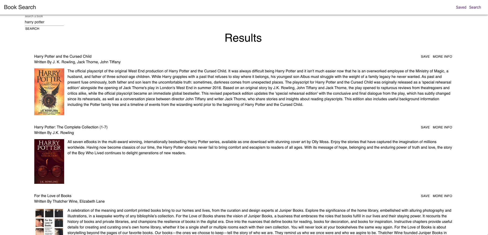

# MERN-Book-Search

## These are the files for the homework assignment associated with section 21 of the OSU Web Development Bootcamp

* Here is a link to the [github](https://github.com/pjdip/MERN-Book-Search)
* Here is a link to the deployed [application](https://warm-thicket-94243.herokuapp.com/)

The goal of this assignment was to build a full-stack MERN application from scratch. This project was bootstrapped with [Create React App](https://github.com/facebook/create-react-app). 

* [Installation](#installation)
* [Usage](#usage)
* [Credits](#credits)
* [Badges](#badges)
* [License](#license)

## Installation

Installation requirements include node.js. Dependencies can be loaded by running 'npm install' from the main directory, once the repo has been cloned. Use the command "npm start" from the main directory in order to run the application locally.

## Usage

This is a one page app. Upon loading, you are presented with a search form. Search for different books, Save them to favorites with the "Save" button or view more details with the "More Info" button. View saved books by clicking the Saved button in the Navbar at the top of the page. From the saved books page, you can delete books from your favorites by clicking the "Delete" button.

Here are some screenshots:

In the project directory, you can run:

### `npm start`

Runs the app in the development mode.\
Open [http://localhost:3000](http://localhost:3000) to view it in the browser.

The page will reload if you make edits.\
You will also see any lint errors in the console.

### `npm run build`

Builds the app for production to the `build` folder.\
It correctly bundles React in production mode and optimizes the build for the best performance.

The build is minified and the filenames include the hashes.\
Your app is ready to be deployed!

See the section about [deployment](https://facebook.github.io/create-react-app/docs/deployment) for more information.

### `npm run eject`

**Note: this is a one-way operation. Once you `eject`, you can’t go back!**

If you aren’t satisfied with the build tool and configuration choices, you can `eject` at any time. This command will remove the single build dependency from your project.

Instead, it will copy all the configuration files and the transitive dependencies (webpack, Babel, ESLint, etc) right into your project so you have full control over them. All of the commands except `eject` will still work, but they will point to the copied scripts so you can tweak them. At this point you’re on your own.

You don’t have to ever use `eject`. The curated feature set is suitable for small and middle deployments, and you shouldn’t feel obligated to use this feature. However we understand that this tool wouldn’t be useful if you couldn’t customize it when you are ready for it.

### Learn More

You can learn more in the [Create React App documentation](https://facebook.github.io/create-react-app/docs/getting-started).

To learn React, check out the [React documentation](https://reactjs.org/).

## Credits

Thanks to React:
* [website](https://reactjs.org/)
* [docs](https://create-react-app.dev/)
* [deployment](https://create-react-app.dev/docs/deployment/#github-pages)

Thanks to [Google Books API](https://developers.google.com/books/docs/v1/using)

Thanks to [axios](https://github.com/axios/axios#handling-errors) for issues with error-handling

Special Thanks to Material-UI:
* [npm](https://material-ui.com/getting-started/installation/)
* [docs](https://material-ui.com/getting-started/installation/)
* [AppBar](https://v3.material-ui.com/demos/app-bar/)
* [Typography](https://material-ui.com/api/typography/)
* [Container](https://material-ui.com/components/container/)
* [Grid](https://material-ui.com/components/grid/)
* [Spacing](https://material-ui.com/system/spacing/)

Special Thanks to [ChilledCow](https://www.youtube.com/channel/UCSJ4gkVC6NrvII8umztf0Ow) for providing chill lofi beats to code to

## Badges

## License

Licensed under the [GNU General Public License v3.0](https://choosealicense.com/licenses/gpl-3.0/)

---